# Лабораторная работа №5

---

#### Отладĸа ĸодовой базы проеĸта на Python с помощью средств отладĸи

---
## Исходные данные

В ĸачестве исходного проеĸта я использую лабораторная работу №4

## ОШИБКА #1 -> ошибка границы цикла (начинается с 1, вместо 0)

**Файл:** `src/simulation.py`  
**Строка:** 28  
**Метод:** `run_simulation()`

### Текущий код (с ошибкой):
```python
for step in range(1, steps):
    print(f"\nШаг {step + 1}")
    casino.simulate_step()
```

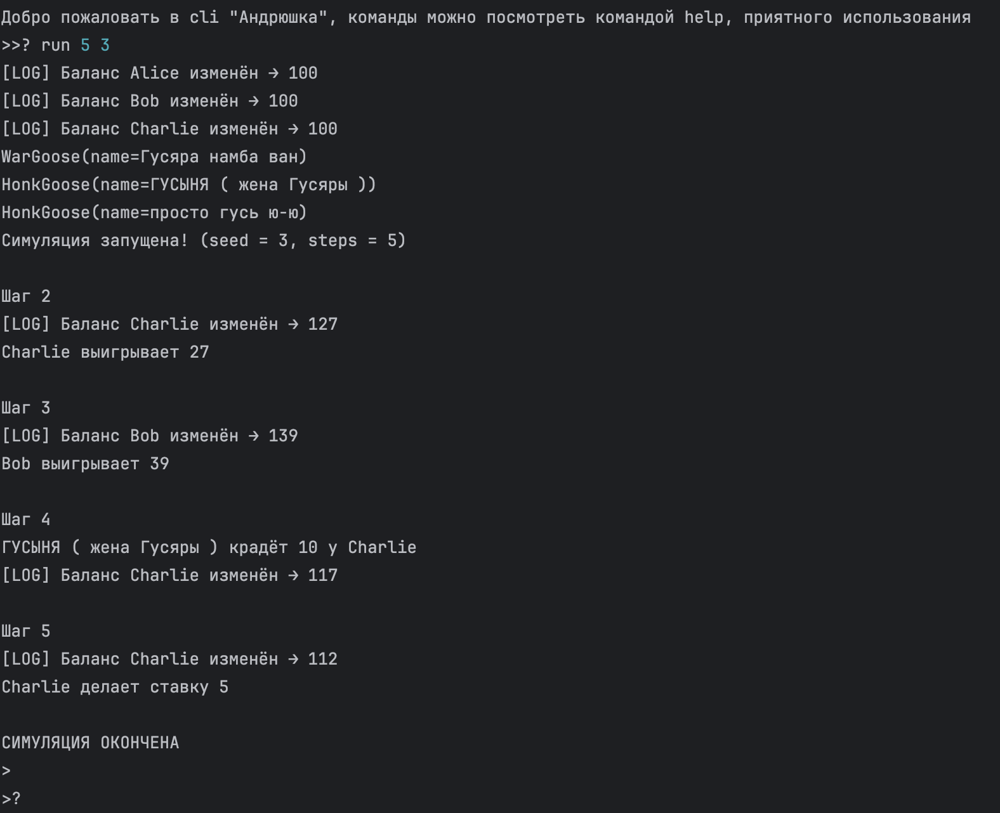

### Правильный код:
```python
for step in range(steps):
    print(f"\nШаг {step + 1}")
    casino.simulate_step()
```
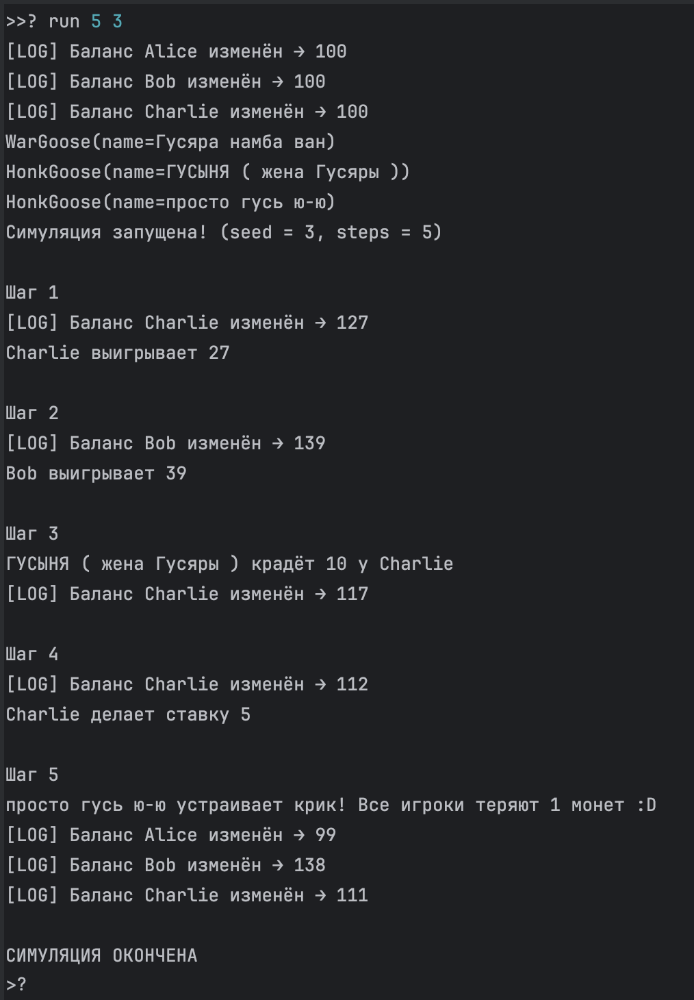

### Симптом:
- Вместо того чтобы назвать 1 шаг первым, он выводит сразу "Шаг 2"
- Выполняется на 1 шаг меньше
- При входных данных steps=5 выполнение программы начинается со 2 шага и продолжается до 5, а значит выполняется только 4 шага, вместо указанных 5

### Как воспроизвести:
Запустить симуляцию с `seed=1` и `steps=5`. Ожидается 5 шагов, но выполнится только 4.

### Отладка:
- Установить breakpoint на строке 28
- Проверить значение `steps` и диапазон `range(1, steps)`
- В отладчике видно, что цикл начинается с 1, а не с 0
- В отладчике видно, что при step: 1 вывод "Шаг 2", вместо "Шаг 1"

### Доказательства:
- 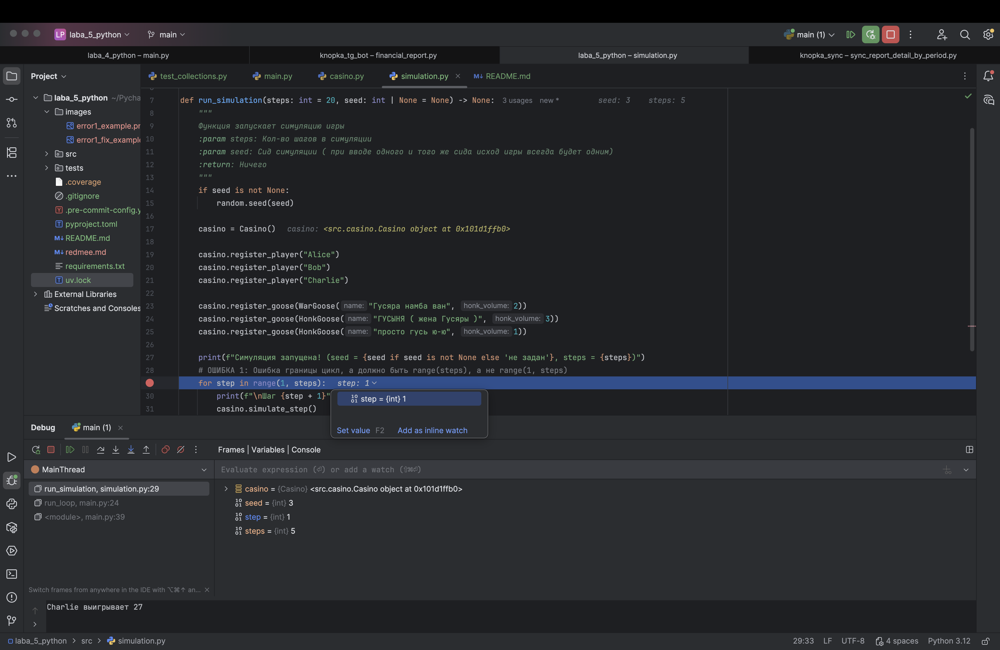
- 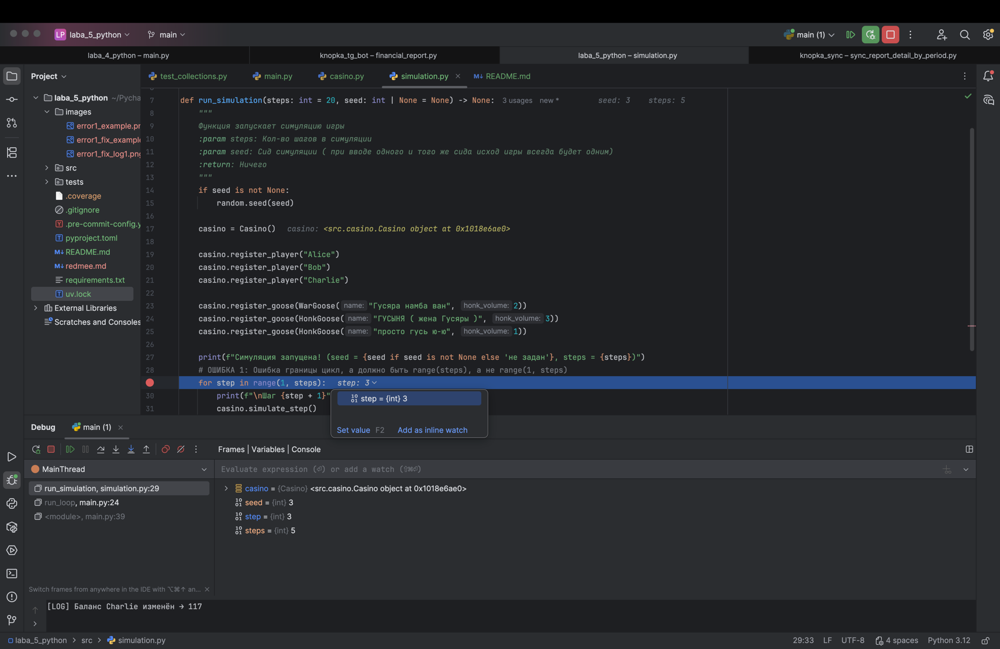

---

## ОШИБКА #2 -> Неверное логическое условие

**Файл:** `src/casino.py`  
**Строка:** 111-114  
**Метод:** `event_steal()`

### Код с ошибкой:
```python
if not self.players:
    raise InsufficientGeeseError("кража")  # Неправильное исключение
if not self.geese:
    raise InsufficientPlayersError("кража")  # Неправильное исключение
```

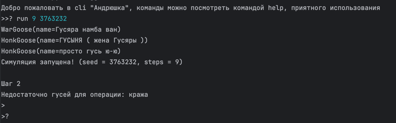

### Правильный код:
```python
if not self.geese:
    raise InsufficientGeeseError("кража")
if not self.players:
    raise InsufficientPlayersError("кража")
```

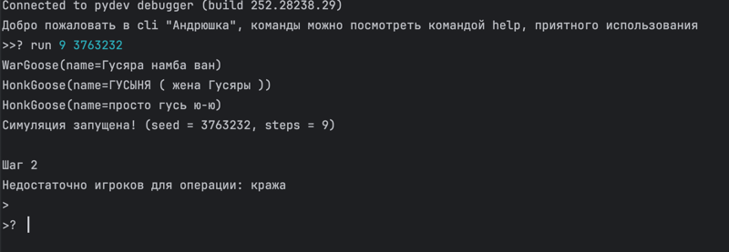

### Симптом:
- При отсутствии игроков выбрасывается `InsufficientGeeseError` вместо `InsufficientPlayersError`
- При отсутствии гусей выбрасывается `InsufficientPlayersError` вместо `InsufficientGeeseError`
- Неправильные сообщения об ошибках

### Как воспроизвести:
Запустить симуляцию без гусей **ИЛИ** без игроков и вызвать событие `event_steal`.

### Доказательство:
- 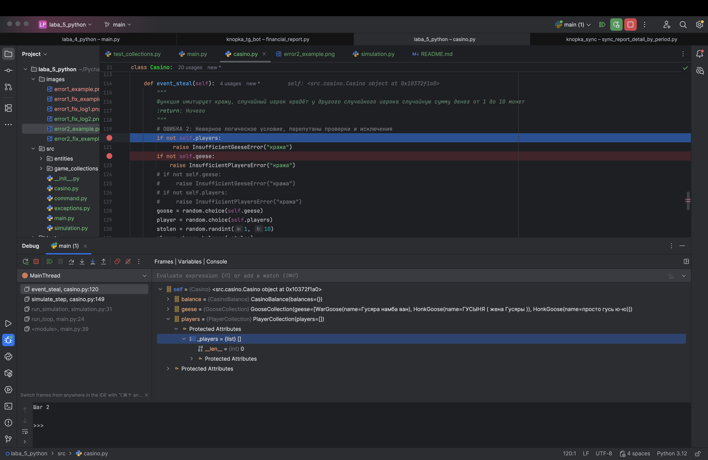

---

## ОШИБКА #3 -> Изменение коллекции во время итерации

**Файл:** `src/casino.py`  
**Строка:** 100-103  
**Метод:** `event_goose_honk()`

### Код с ошибкой:
```python
for p in self.players:
    if p.balance <= 0:
        self.players.remove(p)  # а вот и ОШИБКА! Изменение коллекции во время итерации
    self.balance[p.name] = p.balance
```

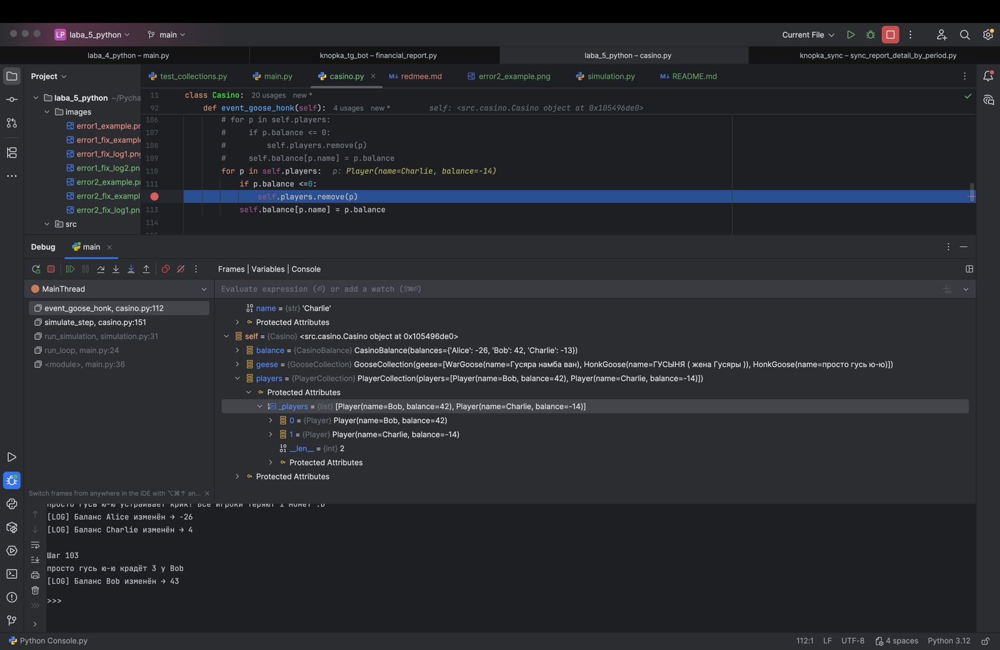

### Правильный код:
```python
for p in self.players:
    self.balance[p.name] = p.balance
```

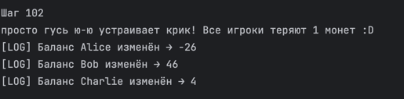

### Симптом:
- Деньги снимаются не у всех игроков

### Причина:
- Питон итерирует по индексам коллекцию, из за чего удаляя текущий элемент на место уже пройденного мной индекса (игрока) встанет тот игрок, который стоял следующим, а значит он будет пропущен и его баланс не изменится

### Как воспроизвести:
Запустить симуляцию, дождаться события `event_goose_honk`, когда у игрока баланс станет <= 0.

---

## ОШИБКА #4 -> Сравнение через `is` вместо `==` ⚠️ ЗАКОММЕНТИРОВАНА

**Файл:** `src/casino.py`  
**Строка:** 24  
**Метод:** `register_player()`

### Код с ошибкой (закомментирован):
```python
if name is "Alice" or name is "Bob" or name is "Charlie":
    raise PlayerAlreadyExistsError(name)
```

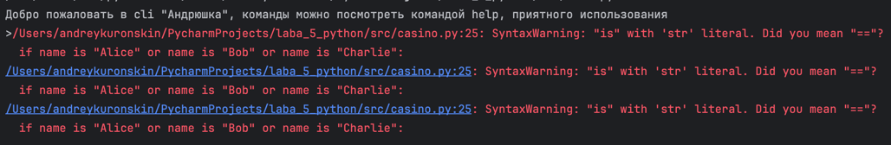

### Правильный код:
```python
if name in [p.name for p in self.players]:
    raise PlayerAlreadyExistsError(name)
```

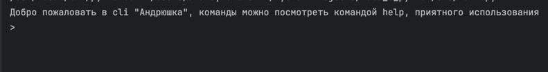

### Симптом:
- Проверка существования игрока работает некорректно
- `is` сравнивает по идентичности объектов, а не по значению
- Может не обнаружить существующих игроков или ложно срабатывать
- Предупреждение при запуске программы :)

### Как воспроизвести:
Попытаться зарегистрировать игрока с именем, которое уже существует в коллекции.

### Доказательства:
- 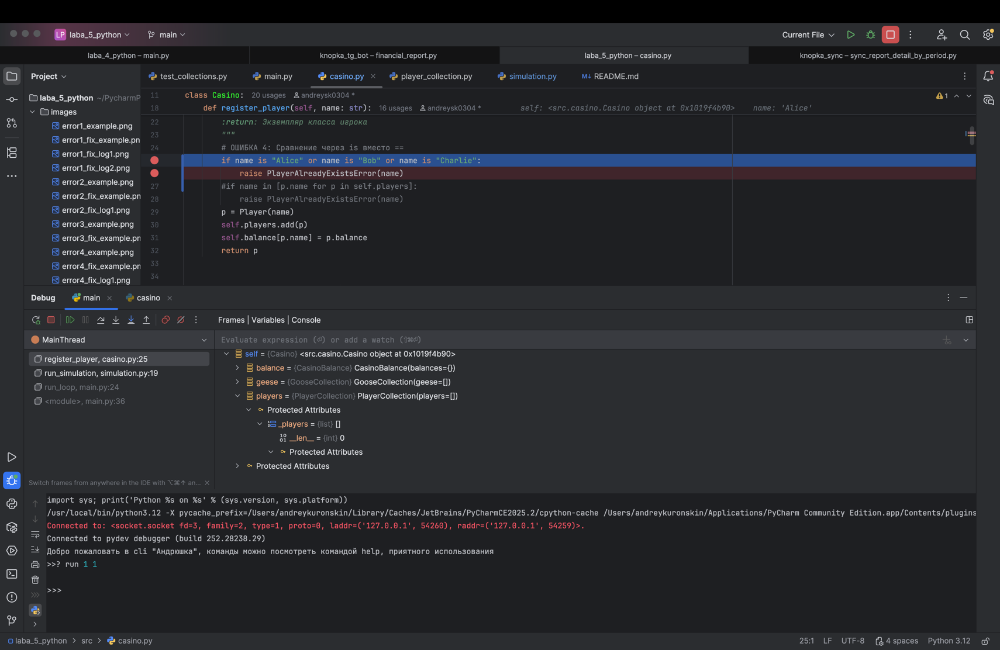

---

## Ошибка #5 -> Перепутанные аргументы

**Файл:** `src/casino.py`  
**Строка:** 50  
**Метод:** `event_player_bet()`

### Код с ошибкой (закомментирован):
```python
player.change_balance(bet)  # ОШИБКА: должно быть -bet
```

### Правильный код:
```python
player.change_balance(-bet)
```

### Симптом:
- При ставке баланс игрока увеличивается вместо уменьшения
- Игроки получают деньги вместо того, чтобы их терять
- Логика игры нарушена

### Как воспроизвести:
Запустить симуляцию и дождаться события `event_player_bet`. Баланс игрока увеличится вместо уменьшения.

### Доказательства:
- 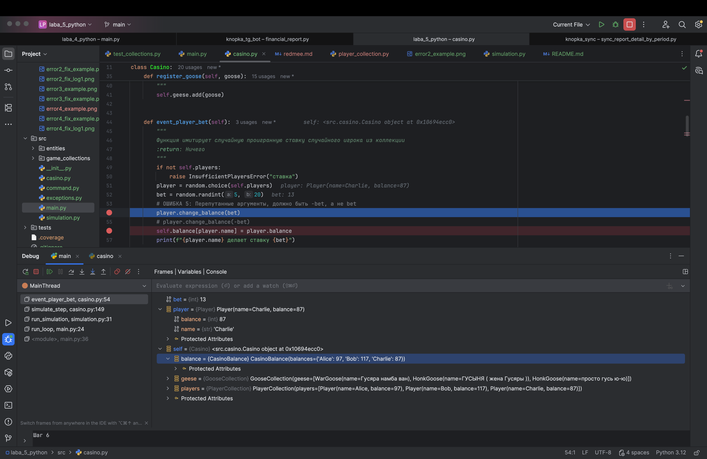
- На втором скриншоте видно, что баланс увеличился вместо того чтобы уменьшится
- 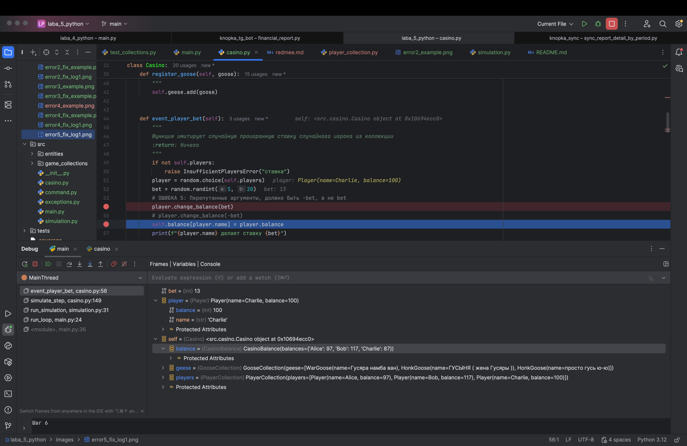
---